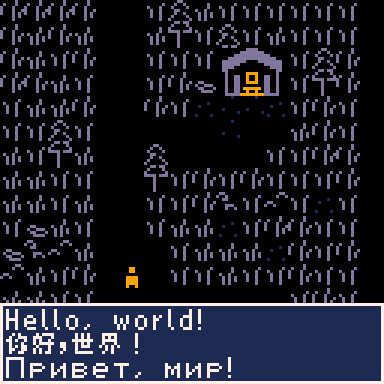

# Picozh

这是一个用来在 [pico-8](https://www.lexaloffle.com/pico-8.php) 中渲染 Unicode 的工具
（主要是中文，其它语言在这个字体里的覆盖程度我没有测试过）。

使用的字体是[全小素](https://diaowinner.itch.io/galmuri-extended)。

# 使用方法
运行`picozh {source} {target}`，程序会根据 `source` 文件里出现的所有字符生成 `target`，
在你的 pico8 文件中 `#include` 生成的文件，使用其中定义的 `gprint` 函数即可。

因为使用 utf8 编码，所以你自己的游戏文件也需要写在另外的 lua 文件中然后 `#include`。
